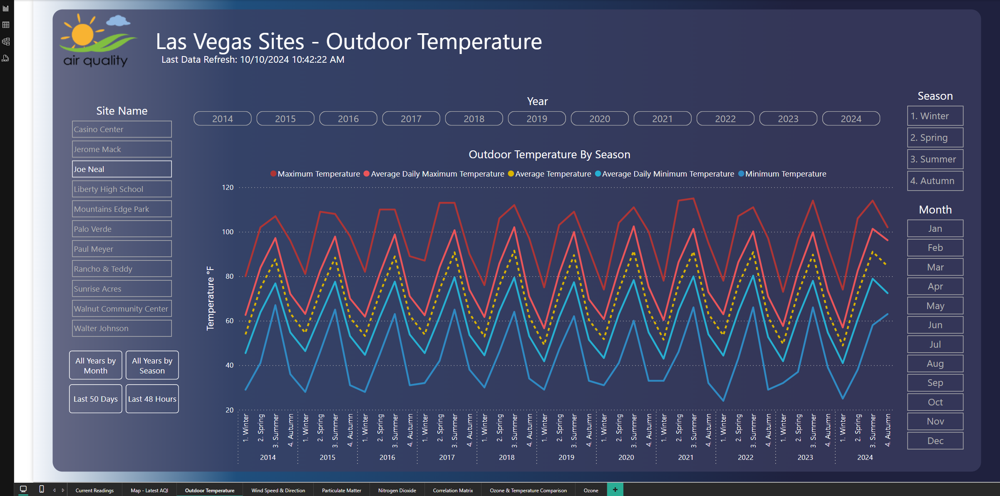
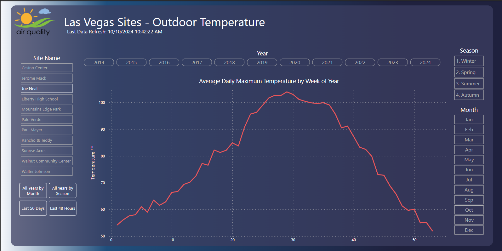
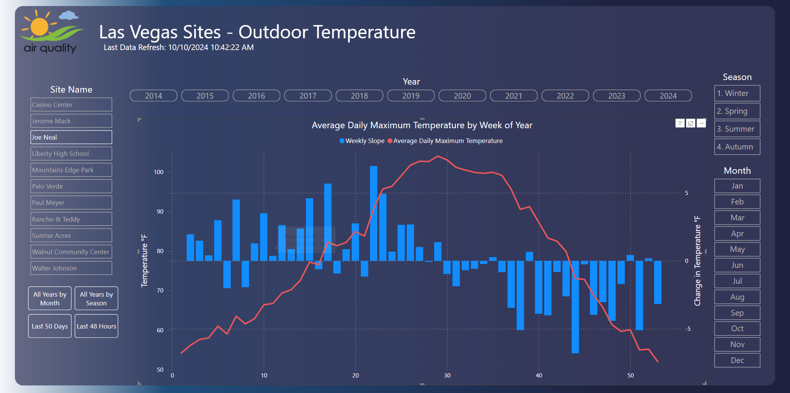
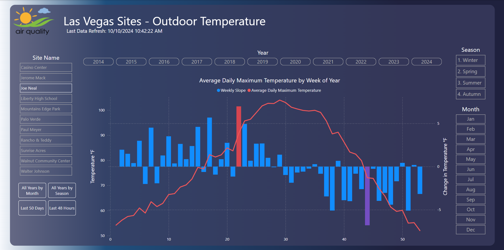

# Sharpest Change in Temperature in Las Vegas

With the changing of seasons and the weather starting to get cooler, I feel like I've always had the assumption that it really starts to cool down in Las Vegas around the week before Halloween. I'm pretty sure that's been my answer to friends who have asked me, “when does it get cold in Las Vegas?”.

This question led me to wonder, when does it actually cool down in Las Vegas and when does it really heat up? Luckily, I’ve been recently playing around with some air quality data which includes temperature data from the last ten years, so I figured I’d jump over to my [Power BI report](https://github.com/alexplainlater/Air_Quality/blob/main/PowerBI/AirQuality.pbix) to see if I could make a couple modifications and see if my intuition is correct.

*Head straight to the [conclusion](#_conclusion) if you’d like to skip the technical details.*

## Technical Details

In my PowerBI report, I already have a sheet created that graphs the outdoor temperature readings, so that seems like a logical starting spot.


*Figure 1: Existing Power BI temperature line chart*

I think it would make more sense to take a look at this by week of the year to reduce some of the noise, but also try to give us some granularity. So, I set the X-axis field to be my WeekNum field in my Calendar table. I already have an existing DAX measure that determines the average daily maximum temperature defined as:

```DAX
_AvgDailyMaxTemp = 
AVERAGEX(
    SUMMARIZE(
        'All Facts',
        'Calendar'[Date],
        "Daily Max", MAXX(
            FILTER('All Facts', 
                'All Facts'[Date] = EARLIER('Calendar'[Date])
            ),
            'All Facts'[Temperature]
        )
    ),
    [Daily Max]
)
```

By adding \_AvgDailyMaxTemp to the Y-axis field, the following line chart is produced:


*Figure 2: Graphing the average daily maximum temperature by week of year*

I can see there are areas where there appears to be sharper increases and sharper decreases, where the slope of the line is steepest.  I wondered if there was a way I could show that in the graph as well, to really identify those inflection points in the year where the temperature changes the most.

To calculate the weekly slope, I created the following DAX measure to find the difference between the average daily maximum temperature between two consecutive weeks:

```DAX
WeeklySlope = 
VAR CurrentWeekNum = MAX('Calendar'[WeekNum])
VAR PreviousWeekNum = CurrentWeekNum - 1
VAR CurrentAvgTemp = CALCULATE([_AvgDailyMaxTemp], 'Calendar'[WeekNum] = CurrentWeekNum)
VAR PreviousAvgTemp = CALCULATE([_AvgDailyMaxTemp], 'Calendar'[WeekNum] = PreviousWeekNum)

RETURN 
IF(
    NOT ISBLANK(CurrentAvgTemp) && NOT ISBLANK(PreviousAvgTemp),
    CurrentAvgTemp - PreviousAvgTemp,
    BLANK()
)
```

After creating this measure, I want to add it to the visual as columns combined with the existing line. To do this, change the visual to a Line and Clustered Column Chart. Next, add WeeklySlope to the visual, and set it as clustered columns by going to the Visualizations pane. Then, navigate to the Format Visual tab, select Y-axis, go to Values, and toggle the Switch axis position to on. This produces the following visual:


*Figure 3: Adding columns highlighting the change in average maximum temperature*

This is great, but to really make the big inflection points pop, I’d like to add some conditional formatting to the WeeklySlope columns.  In the visualizations pane, under format visual, go down to Columns, then Color, then select the Fx button to edit conditional formatting.  From there, we can set the Format style to Rules and base it off of the WeeklySlope measure.  If we make a rule for value >= 99 percent and < 100 percent and set the color to #D64550 and then create another rule for value < 0 percent and >= 1 percent and set its color to #744EC2.

## <a name="_conclusion"></a>Conclusion

By performing the steps above, the resulting chart looks like this:


*Figure 4: Final visual*

From this, we can see that the largest increase in temperature normally happens around week number 22 (typically late May to early June) with an average change in temperature around 6.97 degrees Fahrenheit.  The largest decrease normally happens around week number 44 (typically late October to early November) with an average change in temperature around -6.80 degrees Fahrenheit.  In 2024, week 22 covers dates: May 26 to June 1 and week 44 covers dates: October 27 to November 2.
