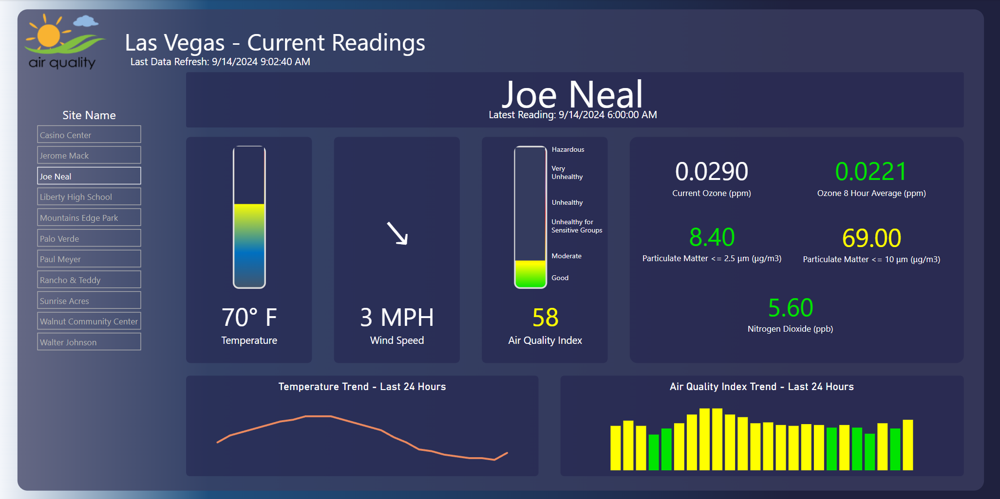
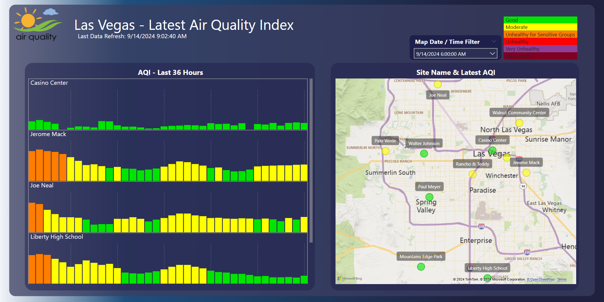
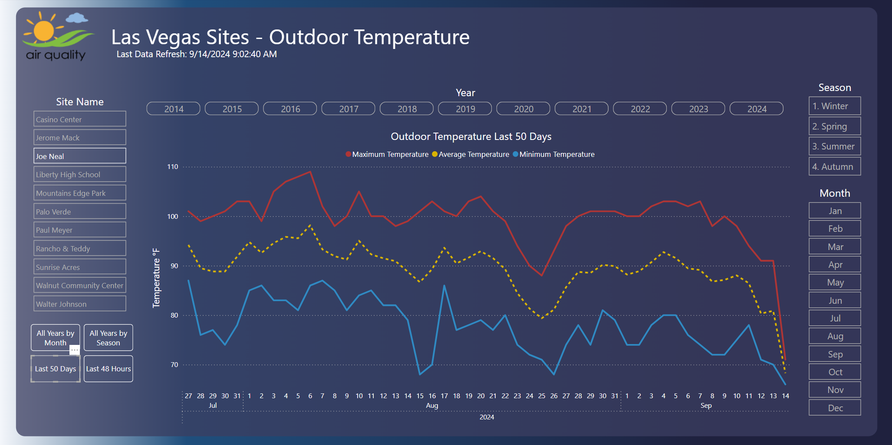
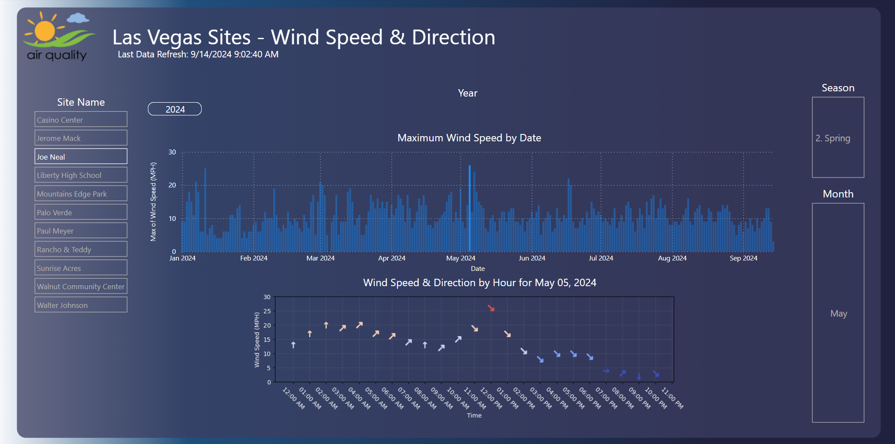
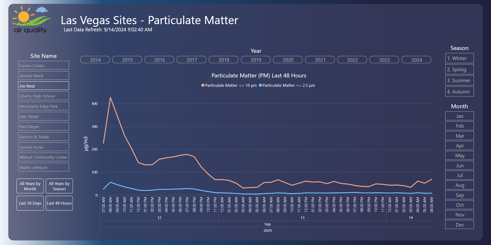
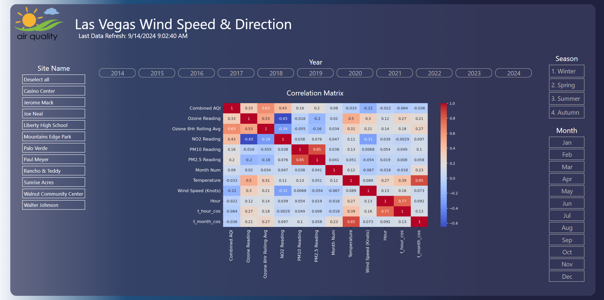

# Air_Quality

 Practice project that gathers and evaluates air quality data from mulitple sources.

## Coding

[Database setup](Scripts/Database_Setup/) - Prepare a Microsoft SQL database and tables to store the data we retrieve.  Written in TSQL and Python.

[Update Data Background Task](Scripts/UpdateDataBackgroundTask/) - Automated background task that will pull new data updates from the AirNow website for most recent updates and the EPA API for historical pulls. Written in Python.

## Analyses

 [Las Vegas Temperature Change](Analysis/Las_Vegas_Temperature_Change/Las_Vegas_Temperature_Change.md) - Investigate when the temperature in Las Vegas has the largest noticeable change.

## Visualization

[Power BI Report](PowerBI/AirQuality.pbix) - Power BI report that visualizes the data in this project.

#### Screenshots

